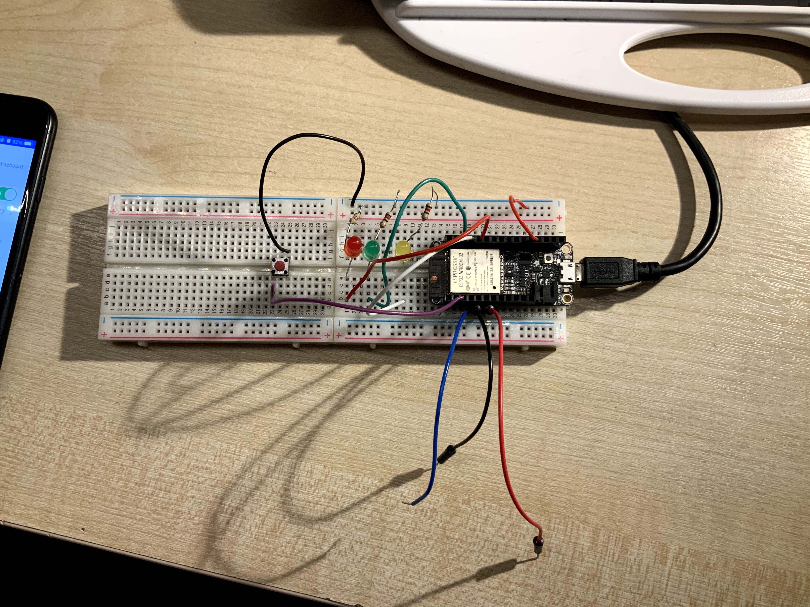
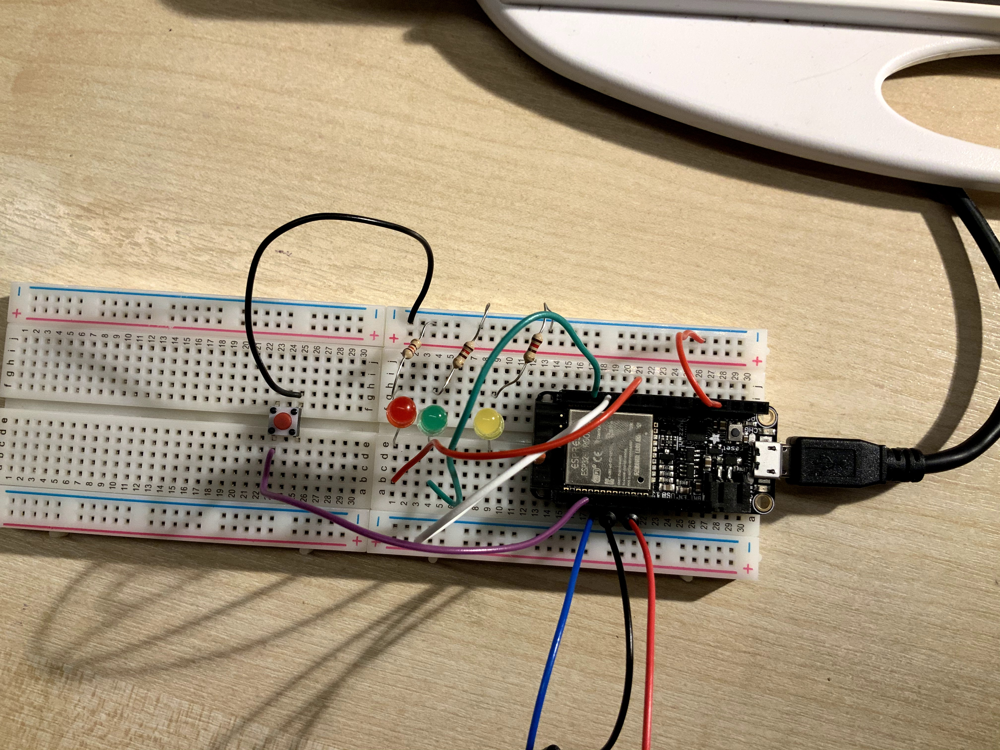
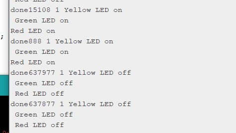

#
COM3505 Assignment1 Report

##Abstract 
a (breadboard-based) IoT device, which accepts control signals via the ESP32's touch sensing capability, flashes LEDs to indicate different types of event, is well-documented at both technical and operational levels, including hardware photographs, a brief video of the system in use and a transcript of serial line diagnostic output and responds to events via a cloud-based integration API that provided by IFTTT,  is created.

##Introduction
The Internet of Things (IoT) is anovel concept and is aimed at enabling the interconnection and integration of the physical world and the IT space.[1]Regarding this device, it controls three different coloured LEDs, red, green and yellow, through three different touch interfaces and they flash at different frequencies. At the same time, the device sends notifications to the phone via a button based on IFTTT's API.
##How to use this drive
###a. How to light up LED lights
After uploading the code, touch the corresponding colour of the wire and the corresponding LED will light up.

###b. How to use the buttons
Change rows 14 and 15 of TouchLED.ino to contain information about your WiFi or hotspot, and then upload the code. When the WiFi connection is successful, press the button and the phone will receive a notification from the IFTTT app.

##Result
###a. Photos of the hardware

For this device, the touchpins for the three LEDs are: red 33, green 15 and yellow 32, with three touch interfaces. The pin for this one button is 14.

###b. Demo Video
[Demo Video](https://youtu.be/UXKB20fWsvk)(YouTube)

###c. Screenshot of serial monitor
####c.1 When the drives starts to run.

At first, no wires or buttons are touched, so all LEDs are shown to be off until the wire for the yellow LED is touched and the display reads yellow LED on.

####c.2 When push the button.

When the button is pressed, the number representing the button changes from a 1 to a 0, at which point the phone is also notified.

####c.3 Touching three wires at the same time.

At this point we will see that all LEDs are on.
##Conclusion 
The device generally works fine and achieves the functions described, but there are still areas that need improvement, for example: the delay in the phone receiving notifications when a button is pressed is too high and when the phone receives a notification, the string inside cannot be changed. I will continue to learn and try to fix these two flaws later.

##Reference
[1] Grover, Siddharth. 2017. “The Internet of Things (2016).” International Journal of Computer Science and Engineering. https://doi.org/10.14445/23488387/ijcse-v4i8p101.
[2] IFTTT Documentation. https://platform.ifttt.com/docs/api_reference#realtime-api
[3] Hamish Cunningham Mi Casa su Botnet?. https://iot.unphone.net/
[4] Espressif Documentation. https://www.espressif.com/en/products/socs/esp32